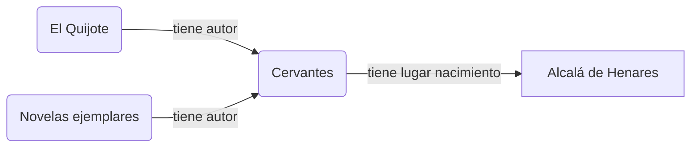
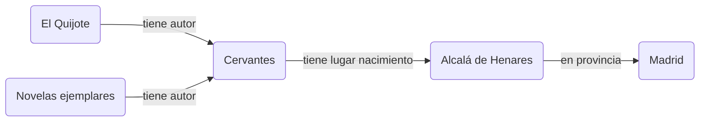
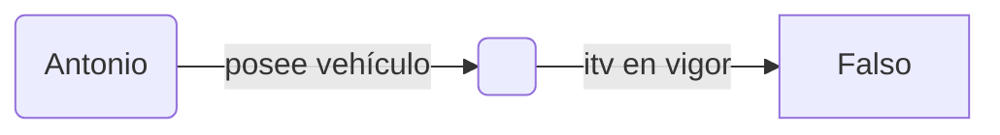

# El modelo de datos RDF

:::{attention} Avance
Los enunciados RDF son estructuras compuestas **por tres términos** RDF. Estos enunciados se pueden agregar en conjuntos de enunciados, que son representables de forma directa como grafos. 
:::

**Enunciado (terna, tripleta)**. Un enunciado  es una secuencia de tres términos como la que sigue: *\<El Quijote\> \<tiene por autor\> \<Cervantes\>*. Los enunciados también se denominan ternas o tripletas.

**Sujeto, predicado (o propiedad) y objeto**. Por su posición en la secuencia, los componentes de un enunciado se etiquetan como `<sujeto><predicado><objeto>`. El predicado también se conoce alternativamente como propiedad.

**Conjunto de enunciados (grafo)**. Los enunciados (concisos y autocontenidos) se pueden agregar en conjuntos de enunciados. Estos conjuntos se representan de forma directa como grafos.


:::{hint} Ejemplo (informal) de grafo RDF
:class: dropdown
Una base de conocimiento sobre obras y autores puede ir acumulando ternas como las que siguen.

```turtle
<El Quijote> <tiene autor> <Cervantes> .
<Novelas ejemplares> <tiene autor> <Cervantes> .
<Cervantes> <tiene lugar nacimiento> <Alcalá de Henares> .
```

Este conjunto de enunciados se puede representar como el siguiente grafo.


:::

## Términos RDF

:::{attention} Avance
Un enunciado es una secuencia de tres términos, pero ¿qué es un termino RDF? 
Un término sólo es, de forma excluyente, o bien **un identificador** o bien **un literal** o bien **un nodo en blanco**.
:::

En principio, las tres posiciones de la terna contienen identificadores salvo las siguientes excepciones:
+ se puede utilizar un literal tan sólo en la tercera posición
+ se puede utilizar un nodo en blanco tan sólo en la primera o  en la tercera posición

:::{math}
:enumerated: false
\left\{
\begin{array}{c}
identificador \\
blanco
\end{array}\right\}\ 
\left\{
\begin{array}{c}
identificador
\end{array}\right\}\ 
\left\{
\begin{array}{c}
identificador \\
literal \\
blanco
\end{array}\right\}
:::


### Identificadores
En principio (salvo literales o nodos en blanco, donde se puedan utilizar), cada término de un enunciado RDF consta de **un identificador universalmente único**. 

:::{important} Motivación
La identificación unívoca de cada término se deriva, como requisito, del uso previsto para estos enunciados RDF en una Web de Datos públicos y enlazados.

+ Por un lado, el modelo de datos RDF pretende facilitar la publicación de ternas propias en la Web, de forma autónoma y descentralizada. 
+ Por otro lado, se desea posibilitar la referencia a enunciados externos, bien como complemento sugerido a los enunciados propios o para (re)utilizar esos mismos términos internamente, asumiendo la semántica que se les asignó.
:::


:::{note} Sobre la necesidad de identificadores universales
:class: dropdown
**_'Barroco'_ para la institución A**. Por un lado, la institución A mantiene públicamente varios enunciados sobre un concepto histórico que denomina internamente *Barroco*, conforme lo entiende y lo modela esa institución. En concreto, lo puede relacionar con otro término propio como *Renacimiento* utilizando cierta relación propia con una determinada semántica asignada.

```turtle
<Barroco> <precedido por> <Renacimiento> .
```

**_'Barroco'_ para la institución B**. Por otro lado, la institución B publica un mapa de bares de una ciudad en forma de enunciados RDF, entre los que se encuentra también *\<Barroco\> \<precedido por\> \<Renacimiento\>* porque ese primer bar se localiza antes (conforme a la numeración de la calle) y en la misma acera que el segundo.

En una infraestructura de datos pública con acceso a estos dos repositorios, conviene separar los enunciados sobre *Barroco* (o los que utilizan *precedido por*) de una institución y de la otra. Incluso si una tercera institución C mantuviera sus propios enunciados sobre movimientos culturales, convendría también singularizarlos de forma separada.

**Un mecanismo de desambiguación: prefijos únicos por institución**. Esta identificación requerida se puede resolver utilizando ciertos prefijos asignados de forma centralizada a cada institución: así `<idA-Barroco>` sería universalmente distinguible de `<idB-Barroco>` si la secuencia de caracteres que componen el prefijo *idA* no coincide con el prefijo asignado a ninguna otra institución.
:::

 **URLs como identificadores**
Ya existe en la organización de la Web un esquema de construcción de identificadores únicos: el que se utiliza para la asignación de direcciones web o URLs (Uniform Resource Locator), que además conduce 'físicamente' hacia ese recurso.

De esta forma, un potencial repositorio de enunciados en la UNED podría etiquetar unívocamente uno de sus términos como `<http://datos.uned.es/recursos/Barroco>` o con cualquier otra variante escogida discrecionalmente por la institución dentro del dominio *uned.es*, como `<http://www.uned.es/historia/Barroco>`.

Sobre este proceso de etiquetado URL de los términos de un enunciado conviene hacer un par de puntualizaciones que se enmarcan en el siguiente desplegable.

:::{note} Sobre identificadores que son o no son localizadores de páginas
:class: dropdown
**Localizadores URLs**. RDF no requiere que esos identificadores conduzcan a una página existente en la Web, que es el uso previsto para una URL. Es suficiente con la garantía de unicidad universal del identificador creado. Sin embargo, para el uso final de enunciados RDF en la Web Semántica, *sí que se recomienda que la URL del identificador conduzca a una página donde se ofrezcan detalles adicionales sobre ese término*.

**Identificadores que no son localizadores**. Las URLs son sólo un subconjunto de los identificadores admitidos para términos RDF. Forman parte de una especificación más general conocida como URI (Uniform Resource Identifiers), entre los que se encuentran esquemas de identificadores como el isbn entre otros. Y a su vez las URIs son sólo un subconjunto de los identificadores IRIs (Intenationalized Resource Identifier), en los que se permite la aparición de cualquier caracter internacional. Estos identificadores no-localizadores pueden encontrarse en algún conjunto de datos RDF ocasionalmente.
:::

### Literales
Los dos siguientes enunciados afirman tanto la fecha de nacimiento como el lugar de nacimiento de Miguel de Cervantes:

```turtle
<Cervantes> <tiene fecha nacimiento> "29/09/1547" .
<Cervantes> <tiene lugar nacimiento> "Alcalá de Henares"
```

En ambos enunciados se aprovecha la opción de almacenar un contenido literal en el *objeto* del enunciado. Esta es una práctica usual y RDF, para automatizar mejor la comprensión de estos literales, permite añadir a cada uno opcionalmente **el idioma en que se expresa** o **el tipo de dato** al que pertenece (una fecha, un número entero, etc). Usando estos complementos a los literales, los enunciados anteriores se pueden expresar como:

```turtle
<Cervantes> <tiene fecha nacimiento> "29/09/1547"^^xsd:date .
<Cervantes> <tiene lugar nacimiento> "Alcalá de Henares"@es .
```

A efectos futuros de búsqueda, los literales sin y con esta información complementaria no se consideran iguales; es decir, "Alcalá de Henares" no resulta ser el mismo literal que "Alcalá de Henares"\@es.

**Dos opciones de modelado para referir a un mismo concepto**. En un ejemplo anterior se sugirió el uso de una URL para identificar al concepto *Alcalá de Henares*, mientras que en este ejemplo se ha utilizado un literal en español que refiere a esa ciudad. Es decir, se han mostrado dos opciones de modelización con sintaxis RDF distinta:

```turtle
<http://ejemp.uned.es/Cervantes> <http://ejemp.uned.es/tiene_lugar_nacimiento> <http://ejemp.uned.es/Alcala_de_Henares> .
<http://ejemp.uned.es/Cervantes> <http://ejemp.uned.es/tiene_lugar_nacimiento> "Alcalá de Henares"@es .
```
:::{note} Sobre la elección entre identificadores o literales en el objeto
:class: dropdown
**Referencia a un concepto utilizando un literal**. Un literal, en un determinado idioma, remite a la comprensión de ese texto por el lector (sea humano o automático); es decir, a la asignación semántica usual de esos caracteres al concepto al que referencian en ese idioma.

**Referencia a un concepto utilizando un identificador**. Un identificador, en principio, no tiene esta sobrecarga semántica añadida. El identificador UNED para "Alcalá de Henares" podría ser tan abstracto como `<http://ejemp.uned.es/X2795B>`. La semántica fijada para este término en este repositorio emergerá del conjunto de enunciados que tienen a ese identificador como sujeto. Estos enunciados pueden ir codificando, de forma más o menos legible, que ese término es una ciudad, que tiene X habitantes, que pertenece a la provincia Y o que su alcalde o alcadesa actual es Z.

+ **Identificador: opción obligatoria si ese concepto es sujeto de otros enunciados**. La sintaxis RDF no permite utilizar literales como sujetos de enunciados. De esta forma, si se va a añadir información complementaria sobre "Alcalá de Henares" en este repositorio no hay otra opción: es obligatorio hacerlo sobre un identificador para ese concepto. Y, en este caso, es más que recomendable codificar que Cervantes nació en (la ciudad asociada a) ese identificador, del que se dispone de información complementaria.


**El uso de literales 'ahorra' identificadores**. Una fecha especial, como el 14 de julio de 1789 para los franceses, se podría codificar con un identificador si va a ser sujeto de enunciados. Pero parece un 'derroche' de identificadores utilizar uno para cada fecha, día tras día. Esto justifica el uso de literales para información complementaria (situada en el *objeto*) si ese término no se va a utilizar como *sujeto* de algún otro enunciado.  
:::

### Nodos en blanco
Un nodo en blanco no contiene un literal ni tampoco un identificador universal. Puede servir para representar el enunciado *"uno de los vehículos de Antonio no tiene la ITV en vigor"* o *"Antonio posee un vehículo X tal que X no tiene la ITV en vigor"*

```turtle
<http://ejemp.uned.es/Antonio> <http://ejemp.uned.es/posee_vehiculo> _:x .
_:x <http://ejemp.uned.es/itv_en_vigor> "false"^^xsd:boolean .
``` 



Toda aplicación que gestione estos enunciados efectivamente asigna un identificador interno al nodo \_:x para confirmar que el nodo objeto del primer enunciado es el mismo que el nodo sujeto del segundo enunciado. Pero ese identificador interno puede ser modificado consistentemente por la aplicación cuando lo necesite, para su gestión propia, y no es público ni sirve para referenciar externamente a ese nodo en blanco en este repositorio.

Los nodos en blanco tienen otros usos avanzados, que se expondrán más adelante.

## Conjuntos de enunciados (grafos)

En su gestión más sencilla, los enunciados RDF se pueden ir agregando incrementalmente en un mismo documento o *dataset*. Todos esos enunciados constituyen un mismo grafo RDF, sin nombre asignado, que se conoce como *grafo por defecto* (default graph) del dataset.

Para organizar la gestión es posible escoger un subconjunto de esos enunciados y agruparlos en un grafo con un nombre asignado. Así, un dataset puede contener varios conjuntos de enunciados distintos (cada uno con su nombre) y el resto de enunciados en su grafo por defecto (sin nombre), que debe ser único.

Como nombre de grafo se utilizan de nuevo identificadores URLs (o IRIs, en general).


