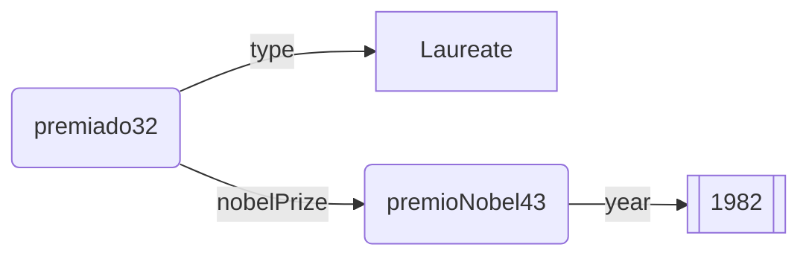

# Composición de patrones

## Un único patrón
El patrón de búsqueda puede constar de tantos enunciados como se requiera y entre estos enunciados aparecen variables (?var1, ..., ?varn). La siguiente consulta utiliza un patrón de búsqueda con tres enunciados entre los que aparecen tres variables.


:::::{hint} Consulta: Premiados, con su Premio y año de concesión
:label: query-premiados-con-premio-y-año
:class: dropdown
:open:

```SPARQL
PREFIX rdf: <http://www.w3.org/1999/02/22-rdf-syntax-ns#>
PREFIX nobel: <http://data.nobelprize.org/terms/>

SELECT DISTINCT ?premiado ?suPremio ?año
WHERE {
    ?premiado rdf:type nobel:Laureate .        #1
    ?premiado nobel:nobelPrize ?suPremio .     #2
    ?suPremio nobel:year ?año .                #3
}
ORDER BY ?año
```
:::::

:::::{admonition} Estructura de la consulta
:class: dropdown
:open:
Si en el grafo del dataset se encontraran los nodos siguientes, el patrón de la consulta marcaría una ocurrencia para los valores (?premiado = premiado32, ?suPremio = premioNobel43,?año = "1982"). Y esta fila de resultados (premiado32, premioNobel43, "1983") se añadiría a la tabla interna de concordancias, con columnas (?premiado, ?suPremio, ?año).


:::::

**Resultados**. La ejecución de esta consulta en https://data.nobelprize.org/sparql ofrece mil filas de concordancias.

La siguiente consulta añade una nueva restricción: los premiados, adicionalmente, deben ser de género femenino. Y sólo se admite una concordancia cuando ocurre en todos los enunciados. Es decir, los premiados con género masculino y aquéllos cuyo género no esté registrado no producen una fila de resultados en la tabla interna de concordancias.

:::::{hint} Consulta: Premiados, con su Premio y año de concesión, siempre que su género sea femenino
:label: query-premiados-con-premio-y-año-femenino
:class: dropdown
:open:
```SPARQL
PREFIX rdf: <http://www.w3.org/1999/02/22-rdf-syntax-ns#>
PREFIX nobel: <http://data.nobelprize.org/terms/>
PREFIX foaf: <http://xmlns.com/foaf/0.1/>

SELECT DISTINCT ?premiado ?suPremioNobel ?año
WHERE {
    ?premiado rdf:type nobel:Laureate .                                          #1
    ?premiado nobel:nobelPrize ?suPremioNobel .                                  #2
    ?suPremioNobel nobel:year ?año .                                             #3
    ?premiado foaf:gender "female" .                                             #4
}
ORDER BY ?año
```
:::::
**Resultados**. La ejecución de esta consulta en https://data.nobelprize.org/sparql se reduce ahora a poco más de sesenta filas de concordancias.


## Grupos de patrones

Los enunciados en WHERE se pueden agrupar en bloques, rodeados sintácticamente por llaves. Si se acota más de un bloque, como por ejemplo {#1, #2, #3} {#4}, cada bloque actúa como un patrón de búsqueda independiente y produce resultados intermedios de ese bloque. Para calcular la respuesta final hay que precisar cómo combinar estos resultados intermedios.

### UNION

Una forma de combinar esos resultados es mediante la unión de los mismos. La siguiente consulta ejecuta esa unión.

:::::{hint} Consulta: primer ejemplo de unión de resultados intermedios
:label: query-union-patrones1
:class: dropdown
:open:

```SPARQL
PREFIX rdf: <http://www.w3.org/1999/02/22-rdf-syntax-ns#>
PREFIX nobel: <http://data.nobelprize.org/terms/>
PREFIX foaf: <http://xmlns.com/foaf/0.1/>

SELECT DISTINCT ?premiado ?suPremioNobel ?año
WHERE {
  { ?premiado rdf:type nobel:Laureate .
    ?premiado nobel:nobelPrize ?suPremioNobel .
    ?suPremioNobel nobel:year ?año . }            # Grupo1
  UNION
  {  ?premiado foaf:gender "female" . }           # Grupo2
}
ORDER BY ?premiado
```
:::::

:::::{note} Estructura de la consulta y resultados
:class: dropdown
:open:
El primer patrón de búsqueda genera una tabla interna de concordancias con tres columnas (?premiado, ?suPremioNobel, ?año) y más de mil filas. El segundo patrón genera una tabla interna con una única columna (?premiado) y unas sesenta filas. Se solicita presentar la unión de estos resultados intermedios. Las filas del segundo patrón (sólo con resultado en la columna ?premiado) se pueden añadir directamente a la tabla del primero. Esto produce una tabla final como la siguiente:

:::{math}
:enumerated: false
\begin{array}{ccc}
?premiado & ?suPremioNobel & \text{?año} \\ \hline
premiado3 & Medicina & 1973 \\
premiado5 & & \\
premiado22 & \text{Física} & 1982 \\
... & ... & ... \\
\end{array}
:::

Se puede ejecutar la pregunta en https://data.nobelprize.org/sparql y se observa cómo hay filas sólo con valores en esa primera columna, que proceden del segundo patrón de consulta.
:::::


Para resaltar la independencia de ambos patrones de búsqueda se recomienda ejecutar la siguiente consulta. Difiere de la anterior en que el segundo patrón almacena sus premiados en una variable distinta de la utilizada en el primer patrón.

:::::{hint} Consulta: segundo ejemplo de unión de resultados intermedios
:label: query-union-patrones2
:class: dropdown
:open:
```SPARQL
PREFIX rdf: <http://www.w3.org/1999/02/22-rdf-syntax-ns#>
PREFIX nobel: <http://data.nobelprize.org/terms/>
PREFIX foaf: <http://xmlns.com/foaf/0.1/>

SELECT DISTINCT ?premiado ?premiadoFem ?suPremioNobel ?año
WHERE {
  { ?premiado rdf:type nobel:Laureate .
    ?premiado nobel:nobelPrize ?suPremioNobel .
    ?suPremioNobel nobel:year ?año . }                # Grupo1
  UNION
  { ?premiadoFem foaf:gender "female" . 
    ?premiadoFem nobel:nobelPrize ?suPremioNobel . }  # Grupo2
}
ORDER BY ?suPremioNobel
```
:::::

:::::{note} Estructura de la consulta y resultados
:class: dropdown
:open:
En este caso, los resultados intermedios producidos por el segundo patrón no se pueden agregar directamente sobre la tabla del primer patrón porque falta la columna ?premiadoFem. La tabla final resultante añade esa columa y tendría la siguiente estructura.
:::{math}
:enumerated: false
\begin{array}{cccc}
?premiado & premiadoFem&  ?suPremioNobel & \text{?a\~no} \\ \hline
premiado3 & & Medicina & 1973 \\
  & premiado5 &  \text{Química} & \\
premiado22 & & \text{Física} & 1982 \\
... & ... & ... & ...\\
\end{array}
:::

Se puede ejecutar la consulta en https://data.nobelprize.org/sparql y comprobar esta composición de resultados.
:::::

### (Intersección)
Dados dos grupos, como en {#1, #2, #3} y {#4, #5}, se puede requerir como resultado final su interseccion; es decir, que sólo se muestren los resultados que aparecen por igual en ambos grupos. Sintácticamente esto se expresa simplemente escribiendo un grupo tras otro: {#1, #2, #3} {#4, #5}, pero esto es equivalente a requerir resultados de un único grupo con esos 5 enunciados como patrón {#1, #2, #3, #4, #5}.

### OPTIONAL

Hay premiados por la Fundación Nobel que no han fallecido (y por tanto, no tienen registrada una fecha de fallecimiento). También hay premiados que no tienen registrada afiliación a una universidad. 

:::::{hint} Consultas: tres ejemplos diferenciados del uso de OPTIONAL
:label: query-ejemplos-optional
:class: dropdown
:open:

Esos resultados (con datos incompletos) no aparecen como respuesta a la siguiente consulta, como se puede comprobar. 
+ No van a aparecer filas en la tabla final sólo con valores en ?premiado y ?nombre y celda vacía en ?fechaFallec o en ?afiliación.
+ Para que una concordancia se añada a la tabla de resultados debe facilitar valores para esas 4 variables de forma que el patrón coincida en ese punto con el grafo de datos.

```SPARQL
PREFIX rdf: <http://www.w3.org/1999/02/22-rdf-syntax-ns#>
PREFIX nobel: <http://data.nobelprize.org/terms/>
PREFIX foaf: <http://xmlns.com/foaf/0.1/>
PREFIX dbp: <http://dbpedia.org/property/>
PREFIX dbo: <http://dbpedia.org/ontology/>

SELECT DISTINCT ?premiado ?nombre ?fechaFallec ?afiliación 
WHERE {
  ?premiado rdf:type nobel:Laureate .                      # 1
  ?premiado foaf:name ?nombre .                            # 2
  ?premiado dbp:dateOfDeath ?fechaFallec .                 # 3
  ?premiado dbo:affiliation ?afiliación .                  # 4
}
ORDER BY ?premiado
```

El uso de OPTIONAL permite admitir filas de resultados con alguna celda en blanco (si se ha marcado como opcional). La siguiente consulta se resume como *"encuentra los resultados del patrón {#1,#2} y amplía cada caso con su ?fechaFallec (si la hubiera) y amplía cada caso con su ?afiliacion (si la hubiera)"*

Como resultado se obtiene una tabla en que necesariamente las filas deben presentar valores en las columnas ?premiado y ?nombre al tiempo que puede o no haber valor en ?fechaFallec e independientemente puede o no haber valor en ?afiliación.

```SPARQL
PREFIX rdf: <http://www.w3.org/1999/02/22-rdf-syntax-ns#>
PREFIX nobel: <http://data.nobelprize.org/terms/>
PREFIX foaf: <http://xmlns.com/foaf/0.1/>
PREFIX dbp: <http://dbpedia.org/property/>
PREFIX dbo: <http://dbpedia.org/ontology/>

SELECT DISTINCT ?premiado ?nombre ?fechaFallec ?afiliación 
WHERE {
  ?premiado rdf:type nobel:Laureate .                      # 1
  ?premiado foaf:name ?nombre .                            # 2
  OPTIONAL {?premiado dbp:dateOfDeath ?fechaFallec .}      # Adicional 3
  OPTIONAL {?premiado dbo:affiliation ?afiliación .}       # Adicional 4
}
ORDER BY ?premiado
```

En la consulta anterior se usaron dos OPTIONAL para independizar la existencia de la fecha de fallecimiento de la existencia de la afiliación. En la siguiente consulta se requieren resultados para {#1,#2} que se pueden ampliar con los obtenidos al ejecutar el patrón {#3,#4}. Pero este último patrón facilita resultados sólo cuando existe a la vez fecha de fallecimiento y afiliación. Así, la tabla de resultados finales presenta dos tipos de filas:
+ O bien aparecen valores en las 4 columnas
+ O bien faltan valores, a la vez, fecha de fallecimiento y afiliación
+ (No ocurrirá que pueda faltar independientemente tan sólo un valor entre fecha de fallecimiento y afiliación, como sí ocurría en la consulta previa).

```SPARQL
PREFIX rdf: <http://www.w3.org/1999/02/22-rdf-syntax-ns#>
PREFIX nobel: <http://data.nobelprize.org/terms/>
PREFIX foaf: <http://xmlns.com/foaf/0.1/>
PREFIX dbp: <http://dbpedia.org/property/>
PREFIX dbo: <http://dbpedia.org/ontology/>

SELECT DISTINCT ?premiado ?nombre ?fechaFallec ?afiliación 
WHERE {
  ?premiado rdf:type nobel:Laureate .                      # 1
  ?premiado foaf:name ?nombre .                            # 2
  OPTIONAL {
    ?premiado dbp:dateOfDeath ?fechaFallec .
    ?premiado dbo:affiliation ?afiliación .
  }                                                       # Adicional {3,4}
}
ORDER BY ?premiado
```
:::::

Estas tres consultas conviene ejecutarlas en https://data.nobelprize.org/sparql, fijándose en cada caso en el número de resultados obtenidos y en los huecos presentes en cada fila.


### MINUS
En una consulta del tipo `{grupo1} MINUS {grupo2}` se evalúan independientemente los resultados de ambos grupos. Se devuelven a lo sumo los resultados del grupo1, *descartando* tan sólo aquéllos que también aparecen en el grupo2.

:::::{hint} Consulta: descarte de resultados mediante MINUS
:label: query-ejemplo-minus
:class: dropdown
:open:

Para apreciar mejor el proceso de resta se ejecuta la siguiente consulta en con MINUS y #4 comentados: se antepone un signo # y esas líneas no se consideran ejecutables (sólo se ejecutan #1, #2 y #3).

```SPARQL
PREFIX rdf: <http://www.w3.org/1999/02/22-rdf-syntax-ns#>
PREFIX nobel: <http://data.nobelprize.org/terms/>
PREFIX foaf: <http://xmlns.com/foaf/0.1/>
PREFIX dbp: <http://dbpedia.org/property/>

SELECT DISTINCT ?reconocimiento ?premiado ?nombre
WHERE {
  { ?reconocimiento rdf:type nobel:LaureateAward .          #1
    ?reconocimiento nobel:laureate ?premiado .              #2
    ?premiado foaf:name ?nombre . }                         #3
  # MINUS 
  # { ?premiado dbp:dateOfDeath ?fechaFallec .}             #4
}
ORDER BY ?reconocimiento
```
Cuando se ejecuta en https://data.nobelprize.org/sparql se obtienen poco más de mil resultados en la tabla (?reconocimiento, ?premiado, ?nombre). En estos resultados es irrelevante que tengan o no fecha de fallecimiento.

La siguiente consulta construye una segunda tabla intermedia para el patrón {#4} con las columnas (?premiado, ?fechaFallecimiento). Las tablas para {#1,#2,#3} y {#4} tienen en común la variable ?premiado. En el resultado final, de la tabla para {#1,#2,#3} se eliminan las filas cuyo valor para ?premiado aparezca en la tabla de resultados para {#4}.

```SPARQL
PREFIX rdf: <http://www.w3.org/1999/02/22-rdf-syntax-ns#>
PREFIX nobel: <http://data.nobelprize.org/terms/>
PREFIX foaf: <http://xmlns.com/foaf/0.1/>
PREFIX dbp: <http://dbpedia.org/property/>

SELECT DISTINCT ?reconocimiento ?premiado ?nombre
WHERE {
  { ?reconocimiento rdf:type nobel:LaureateAward .          #1
    ?reconocimiento nobel:laureate ?premiado .              #2
    ?premiado foaf:name ?nombre . }                         #3
  MINUS 
  { ?premiado dbp:dateOfDeath ?fechaFallec .}               #4
}
ORDER BY ?reconocimiento
```

Si se ejecuta esta consulta con MINUS en https://data.nobelprize.org/sparql se obtendrán los resultados de la consulta anterior excepto aquéllos con fecha de fallecimiento. Es decir, esta consulta tan sólo facilita los premiados vivos de la tabla anterior.
:::::
