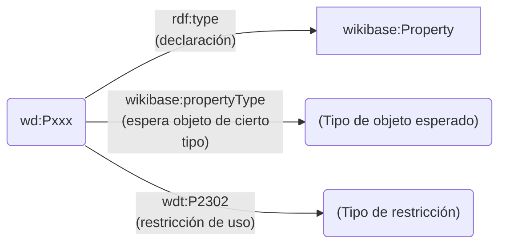
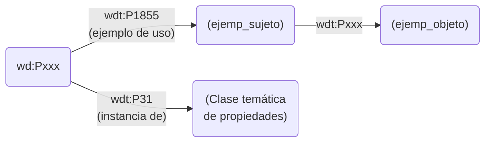
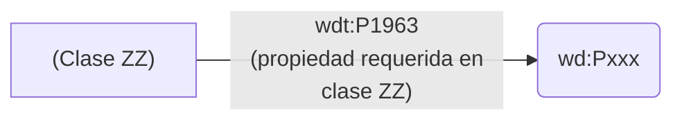
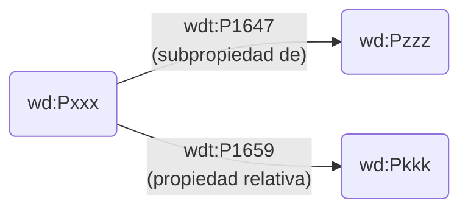

# Propiedades en Wikidata

## Declaración de propiedades
La aceptación de una nueva propiedad en Wikidata requiere de un proceso de estudio y acuerdo muy regulado. Por ello el número de propiedades (alrededor de doce mil) es significativamente menor que el de clases.


En Wikidata, la incorporación de una nueva propiedad requiere las siguientes acciones:
1. La asignación de su identificador `wd:Pxxx` y su declaración (vía rdf:type) como perteneciente a la clase wikibase:Property.
2. Cuando relacione sujeto y objeto (como en `<X><wdt:Pxxx><Y>`), qué tipo dato se espera en Y.
3. Si es el caso, qué restricciones de uso se asignan a esta propiedad wd:Pxxx

### Detección de propiedades en Wikidata
Como todas las propiedades se declaran pertenecientes a la clase wikibase:Property, la siguiente consulta retorna todas las propiedad en Wikidata junto a sus etiquetas textuales:

```SPARQL
SELECT ?prop ?propLabel ?propDescription ?propAltLabel
WHERE {
  ?prop rdf:type wikibase:Property .
  SERVICE wikibase:label { bd:serviceParam wikibase:language "en"}
}
```
[Ejecución en Wikidata](https://w.wiki/6VFD)


### Tipo de dato de una propiedad
De una propiedad como *tiene por padre* ([P22](https://www.wikidata.org/wiki/Property:P22)) se espera un uso `<X><wdt:P22><Y> que asocia un ítem X de Wikipedia con otro ítem Y de Wikipedia. La propiedad *tiene por identificador en la BNE* asocia un ítem X de Wikipedia con un identificador externo. Hay otras propiedades que asocian un ítem X con un texto (un literal), o con una imagen, entre otros tipos de dato posibles.

La propiedad 'prop' en `<suj><prop><obj>` asocia el sujeto con un objeto que puede pertenecer a uno de pocos tipos de dato. La siguiente consulta devuelve los distintos tipos de dato y el número de propiedades que esperan ese tipo en sus objetos.


```SPARQL
SELECT ?prop_tipo (COUNT(?prop) AS ?numProps)
WHERE {
  ?prop rdf:type wikibase:Property .
  ?prop wikibase:propertyType ?prop_tipo
}
GROUP BY ?prop_tipo
ORDER BY DESC(?numProps)

```
[Ejecución en Wikidata](https://w.wiki/DbKR)

Más detalladamente, se puede ejecutar un consulta que devuelve todas las propiedades con su tipo de dato correspondiente.

```SPARQL
SELECT ?prop ?propLabel ?prop_tipo
WHERE {
  ?prop rdf:type wikibase:Property .
  ?prop wikibase:propertyType ?prop_tipo
  SERVICE wikibase:label { bd:serviceParam wikibase:language "en"}
}
ORDER BY ?prop_tipo
```
[Ejecución en Wikidata](https://w.wiki/DbK8)


### Restricciones de uso de una propiedad
La asignación de restricciones de uso a una propiedad es un tema detalladamente técnico que no concierne a un usuario de Wikidata. Las restricciones son tan sólo indicaciones formalizadas que ayudan a los editores de datos en Wikidata a detectar errores de edición. Por ejemplo, la propiedad P6 (*tiene por jefe de este órgano de gobierno a*) espera que el objeto de tripleta sea una persona.

Se puede obviar este apartado en una primera lectura. En el porta de ayuda de Wikidata hay una página dedicada a la [asignación de restricciones a una propiedad](https://www.wikidata.org/wiki/Help:Property_constraints_portal). La siguiente consulta muestra, para cada propiedad, qué restricciones formales tiene declaradas:

```SPARQL
SELECT ?prop ?propLabel ?propDescription ?restricción ?restricciónLabel ?restricciónDescription
WHERE {
  ?prop rdf:type wikibase:Property .
  ?prop wdt:P2302 ?restricción .
  SERVICE wikibase:label { bd:serviceParam wikibase:language "en". }
}
ORDER BY ?prop
```
[Ejecución en Wikidata](https://w.wiki/DbPf)


## Clasificación por temática de uso
De cada propiedad se facilita al menos un ejemplo de uso. Las propiedades pueden agruparse entre sí conforme al área temática de uso para las que fueron propuestas.



### Ejemplo de uso de cada propiedad
De cada propiedad creada se facilita, al menos, un ejemplo de uso. La relación entre propiedad y ejemplo se expresa mediante P1855, que enlaza la propiedad con el sujeto del ejemplo.

```SPARQL
SELECT ?sujetoEj ?sujetoEjLabel ?propWdt ?propLabel ?objetoEj ?objetoEjLabel
WHERE {
  ?prop wikibase:directClaim ?propWdt .
  ?prop wdt:P1855 ?sujetoEj .
  ?sujetoEj ?propWdt ?objetoEj .
  SERVICE wikibase:label { bd:serviceParam wikibase:language "en". }
}
```
[Ejecución en Wikidata](https://w.wiki/6fDV)

### Clases temáticas de propiedades
Las propiedades se asignan a clases, que las agrupan. Algunas de estas clases pueden ser subclases de otras.

```SPARQL
SELECT ?prop ?propLabel ?propClase ?propClaseLabel ?propSuperClase ?propSuperClaseDescription
WHERE {
  ?prop rdf:type wikibase:Property .
  ?prop wdt:P31 ?propClase .
  OPTIONAL{?propClase wdt:P279 ?propSuperClase .}
  SERVICE wikibase:label { bd:serviceParam wikibase:language "en". }
}
ORDER BY ?propClase
```
[Ejecución en Wikidata](https://w.wiki/DbHH)

### Propiedad requerida por una clase de items



Algunas clases de ítems requieren el uso de ciertas propiedades sobre ellos para completar la información básica que se espera de ese ítem.

```SPARQL
SELECT ?claseÍtems ?claseÍtemsLabel ?propRequerida ?propRequeridaLabel
WHERE {
  ?claseÍtems wdt:P1963 ?propRequerida .
  SERVICE wikibase:label { bd:serviceParam wikibase:language "en". }
}
```
[Ejecución en Wikidata](https://w.wiki/6fVW)

## Relación entre propiedades


### Subpropiedades
La siguiente consulta devuelve todas las propiedades en Wikidata. Opcionalmente, cuando sea el caso de que una propiedad (en ?prop) es subpropiedad de otra (en ?prop_super), indica esta inclusión.

```SPARQL
SELECT ?prop ?propLabel ?propDescription ?prop_super ?prop_superLabel
WHERE {
  ?prop rdf:type wikibase:Property .
  OPTIONAL {?prop wdt:P1647 ?prop_super .}
  SERVICE wikibase:label { bd:serviceParam wikibase:language "en". }
}
ORDER BY ?prop
```
[Ejecución en Wikidata](https://w.wiki/DbQH)

### Propiedades relativas

De cada propiedad se puede indicar que hay otras propiedades relacionadas, por una razón u otra. La siguiente consulta muestra esta relación entre propiedades:

```SPARQL
SELECT ?prop ?propLabel ?propDescription ?prop_relat ?prop_relatLabel
WHERE {
  ?prop rdf:type wikibase:Property .
  OPTIONAL {?prop wdt:P1659 ?prop_relat .}
  SERVICE wikibase:label { bd:serviceParam wikibase:language "en". }
}
ORDER BY ?prop
```
[Ejecución en Wikidata](https://w.wiki/DbRE)

