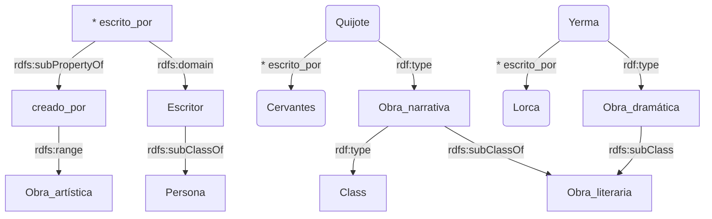

# Cómo categorizar datos RDF

En un conjunto de enunciados RDF pueden aparecer diversos *autores* (Cervantes, Lorca, ...) relacionados con sus *obras* (Quijote, Yerma, Poeta en Nueva York, ...) o con sus *lugares* de nacimiento (Alcalá de Henares, Madrid, Fuente Vaqueros, Granada, España, ...). Sin embargo, los ejemplos RDF mostrados hasta este punto no asignan explícitamente términos a clases como *obras*, *personas* o *lugares*.

## Pertenencia e inclusión
El modelo de datos RDF incorpora una ampliación conocida como RDFS (*RDF Schema*) que permite añadir a un grafo RDF otros enunciados que categorizan sus términos. De momento, y de manera informal, se muestra un grafo que hace uso de esa ampliación sintáctica.

:::::{hint} Ejemplo de grafo RDF(S) con clases y subclases declaradas
:label: ej-grafo-RDFS
:::mermaid
flowchart TD
    Q(u:Quijote) -->|u:autor| C(u:Cervantes)
    Y(u:Yerma) -->|u:autor| L(u:Lorca)
    Q -->|de tipo| N[u:Obra narrativa]
    Y -->|de tipo| D[u:Obra dramática]
    N -->|subclase de| O[u:Obra literaria]
    D -->|subclase de| O
    O -->|subclase de| A[u:Obra artística]
:::
:::::

Del diagrama anterior conviene resaltar los siguientes detalles:

+ **Relación entre entidades**. *Quijote* y *Cervantes* son dos entidades, con una relación *tiene_autor* de la primera a la segunda. Lo mismo ocurre con *Yerma* y *Lorca*.
    - En la modelización de un grafo los autores pueden proponer las relaciones que consideren adecuadas entre entidades, con el nombre que deseen.
+ **Pertenencia a una clase**. El elemento *Quijote* pertenece a la clase *Obra narrativa*, que es un concepto que agrupa éste y otros elementos similares. También se afirma que *Yerma* pertenece a la clase *Obra dramática*.
    -  **Es la única relación posible entre un elemento y una clase**: la pertenencia de un elemento a una clase. Esta relación, con ese significado ('es un', 'es de tipo', 'pertenece a'), se requiere en el modelado de casi todos los grafos RDF compartidos en la Web de Datos Enlazados. Y por tanto, **el lenguaje RDF facilita un identificador prefijado para esta relación de pertenencia**, de uso común en todo grafo.
+ **Inclusión, ser subclase de otra clase**. En el diagrama anterior aparecen otras clases, como por ejemplo, *Obra literaria*. A esta clase, como a cualquier otra, se pueden asignar directamente elementos pero no ocurre así en el ejemplo anterior. Adicionalmente, se puede afirmar, como sí ocurre, que una clase como *Obra dramática* es subclase de *Obra literaria*; es decir, que todo elemento asignado a *Obra dramática* también cumple con lo que se requiere para pertenecer a *Obra literaria*.
    - **Es la única relación reconocida como posible entre una clase y otra clase**: la inclusión de una clase en otra. Esta relación, con este significado, aparece en el modelado de cualquier grafo sobre el que se quiere superponer una taxonomía, una jerarquía de clases. **El lenguaje RDF facilita un identificador prefijado para esta relación de inclusión**, de uso común.

:::{important} Identificadores comunes para todo grafo RDF
Para expresar la pertenencia de un elemento a una clase o la inclusión de una clase en otra es obligatorio utilizar los siguientes identificadores:
+ `rdf:type` (es un, pertenece a, es de tipo):
    +  `<http://www.w3.org/1999/02/22-rdf-syntax-ns#type>`
+ `rdfs:subClassOf` (está incluida en, es subclase de):
    +  `<http://www.w3.org/2000/01/rdf-schema#subClassOf>`

**Nota**. RDFS proporcionará otros identificadores de uso común para conceptualizar términos. Todos ellos comienzan su URI con el prefijo `rdfs:`, que abrevia el inicio de dirección *http://www.w3.org/2000/01/rdf-schema#*. Tan sólo rdf:type (y rdf:Property), por razones históricas, se fijaron inicialmente con la dirección asociada al prefijo `rdf:`. 
:::

El siguiente desplegable muestra, en formato Turtle, los enunciados [del diagrama inicial](#ej-grafo-RDFS).

:::::{note} Uso de los identificadores 'de tipo' y 'subclase'
:class: dropdown
```turtle
PREFIX rdf: <http://www.w3.org/1999/02/22-rdf-syntax-ns#>
PREFIX rdfs: <http://www.w3.org/2000/01/rdf-schema#>
PREFIX u: <http://datos.uned.es/ej/>

u:Quijote u:autor u:Cervantes ;
          rdf:type u:Obra_narrativa .
u:Yerma u:autor u:Lorca ;
        rdf:type u:Obra_dramatica .
u:Obra_narrativa rdfs:subClassOf u:Obra_literaria .
u:Obra_dramatica rdfs:subClassOf u:Obra_literaria .
```

**Nota 1**. Las declaraciones iniciales de prefijo también se pueden expresar sintáticamente como sigue: `@prefix rdf: <http://www.w3.org/1999/02/22-rdf-syntax-ns#> .`

**Nota 2 (sobre rdf:type en Turtle)**. Para expresar que *'I es del tipo (o es un) C'*, Turtle permite reemplazar `rdf:type` por `a` ('es_un'). Así, *'I a C'* es otra forma de expresar *'I rdf:type C'*.
:::::


## RDFS: opciones para categorizar
Los dos identificadores citados, el de pertenencia a una clase y el de inclusión de una clase en otra, son los identificadores reservados más utilizados. Pero RDFS facilita algunos más, entre los que conviene resaltar los siguientes.

:::{table} Identificadores RDF(S) para la categorización de términos
:label: tabla-identificadores-RDFS
:align: center

|                             |                                            |
| --------------------------- | ------------------------------------------ |
| C `rdf:type` `rdfs:Class`   |  C se declara explícitamente como clase    |
| I `rdf:type` C              |  I pertenece a la clase C                  |
| C1 `rdfs:subClassOf` C2     |  La clase C1 es subclase de la C2          |
| P `rdf:type` `rdf:Property` |  P se declara explícitamente propiedad     |
| P1 `rdfs:subPropertyOf` P2  |  P1 es una subpropiedad de P2              |
| P `rdfs:domain` C           |  P tiene por dominio la clase C            |
| P `rdfs:range` C            |  P tiene por rango la clase C              |
:::

El uso de estos identificadores en la construcción de enunciados se debe ajustar a la siguiente semántica:

+ **Subclase**. Cuando se declara que 'C1 es subclase de C2' se está afirmando que *todo elemento de C1 debe ser considerado también elemento de C2*. Por ejemplo, una taxonomía zoológica podría incluir el enunciado 'Mamíferos subclase_de Vertebrados'.

+ **Subpropiedad**. Cuando se declara que 'P1 es subpropiedad de P2' se está afirmando que *todo par de elementos (I1,I2) relacionados por P1 también están relacionados por P2*. Por ejemplo, se puede considerar que la propiedad P1 'es_hijo_de' es una subpropiedad de P2 'es_familiar_de'.

+ **Dominio y rango de una propiedad**.Cualquier propiedad P se usa para relacionar un sujeto con un objeto: *\<sujeto\> \<P\> \<objeto\>*, como en '\<I1\> \<es_creador_de\> \<I2\>'.  
  Cuando se declara que el dominio de P es una clase C1 se está afirmando que *todo sujeto en la relación \<s\>\<P\>\<o\> debe considerarse de la clase C1*. Así, se podría fijar explícitamente que el dominio de 'es_creador_de' es la clase 'Persona'.  
    Cuando se declara que el rango de P es una clase C2 se está afirmando que *todo objeto en la relación \<s\>\<P\>\<o\> debe considerarse de la clase C2*. Así, se podría fijar explícitamente que el rango de 'es_creador_de' es la clase 'Obra_artística'.

RDFS facilita algunos identificadores de uso más técnico, que se utilizan de forma menos generalizada. En esta introducción tan sólo se menciona entre ellos a `rdfs:label`, que sirve para adjuntar una etiqueta textual a un nodo.

+ **Etiquetas textuales (rdfs:label)**. Un repositorio RDF puede optar porque sus identificadores sean no legibles (en ningún idioma), como por ejemplo `u:M2347`. Los dos siguientes enunciados (en Turtle) añaden a este identificador la etiqueta 'Londres' (en español) y la etiqueta 'London' en inglés:  
`u:M2347 rdfs:label "Londres@es , "London"@en .`

:::{note} Relación de todos los identificadores en RDFS
La relación completa se puede encontrar en el documento del W3 [RDFS Schema 1.1](https://www.w3.org/TR/rdf11-schema/). Los identificadores más relevantes para un modelador o consultor de grafos RDF ya se han expuesto. Quedan otros que son de interés a más bajo nivel, para las aplicaciones que gestionan esa información.
:::

## Expresividad e inferencia RDFS
Un conjunto de enunciados consta, en principio, de sus tripletas explícitamente escritas. De la aceptación de estas tripletas explícitas se pueden deducir  otras conforme a las reglas de inferencia RDFS, que deben aceptarse irremediablemente porque son consecuencia de las anteriores. Un razonador RDFS añadiría estas nuevas tripletas deducidas. 

Puede ocurrir que de este nuevo conjunto ampliado, utilizando de nuevo las reglas de inferencia RDFS, se deduzcan nuevas tripletas. Este proceso iterativo de explicitación de consecuencias se puede continuar hasta que no se añada ninguna tripleta adicional.

A continuación se enumeran las reglas de inferencia RDFS más relevantes. Una descripción más técnica y detallada se puede encontrar en la [secc. 4.4 del texto Web of Data](https://aidanhogan.com/wodata/book.pdf#page=187) (Aidan Hogan, 2020).

:::::{admonition} Si un elemento es de tipo C entonces se deduce como clase
:class: dropdown
Es posible asignar la pertenencia de un elemento I a una clase C que no ha sido declarada explícitamente como clase. Cuando esto ocurre, hay una regla de inferencia que deduce (implícitamente) la declaración de C como clase.

:::{math}
:enumerated: false
\text{<I> <rdf:type> <C>}\quad \Rightarrow \quad \text{<C> <rdf:type> <rdfs:Class>}
:::
:::::


:::::{admonition} A C2 pertenecen todos los elementos de su subclase C1
:class: dropdown
Si C1 es subclase de C2 (porque se ha declarado así o se inferido como tal), de todo elemento explícitamente asignado a C1 se puede deducir que pertenece a C2.

:::{math}
:enumerated: false
 \left.
 \begin{array}{c}
   \text{<C1> <rdf:subClassOf> <C2>} \\
   \text{<I> <rdf:type> <C1>}
 \end{array}
 \right\rvert \Rightarrow  \text{<I> <rdf:type> <C2>}
:::
:::::

:::::{admonition} La inclusión de clases C1 $\subseteq$ C2 $\subseteq$ C3 es transitiva
:class: dropdown
Si C1 es subclase de C2 y también C2 es subclase de C3 entonces se puede deducir que C1 es subclase de C3.

:::{math}
:enumerated: false
 \left.
 \begin{array}{c}
   \text{<C1> <rdfs:subClassOf> <C2>} \\
   \text{<C2> <rdfs:subClassOf> <C3>}
 \end{array}
 \right\rvert  \Rightarrow  \text{<C1> <rdfs:subClassOf> <C3>}
:::
:::::

:::::{admonition} Si P relaciona un par de elementos entonces se deduce como propiedad
:class: dropdown
Es posible relacionar dos elementos I1 e I2 mediante una propiedad P que no ha sido declarada explícitamente como propiedad. Cuando esto ocurre, hay una regla de inferencia que deduce (implícitamente) la declaración de P como propiedad.

:::{math}
:enumerated: false
\text{<I1> <P> <I2>}\quad \Rightarrow \quad \text{<P> <rdf:type> <rdf:Property>}
:::
:::::

:::::{admonition} P2 relaciona todos los pares elementos de su subpropiedad P1
:class: dropdown
Si P1 se declara subpropiedad de P2, entonces de todo par explícitamente relacionado por P1 se puede deducir que también lo está por P2

:::{math}
:enumerated: false
\left.
 \begin{array}{c}
   \text{<P1> <rdf:subPropertyOf> <P2>} \\
   \text{<I1> <P1> <I2>}
 \end{array}
 \right\rvert \Rightarrow  \text{<I1> <P2> <I2>}
:::
:::::  

:::::{admonition} La relación _'ser subpropiedad de'_ es transitiva 
:class: dropdown
Si P1 se declara subpropiedad de P2 y también P2 se declara subpropiedad de P3 entonces se puede deducir que P1 es subpropiedad de P3 (y, por tanto, todo par de elementos relacionados por P1 se pueden afirmar relacionado por P2).
:::{math}
:enumerated: false
\left.
 \begin{array}{c}
   \text{<P1> <rdfs:subPropertyOf> <P2>} \\
   \text{<P2> <rdfs:subPropertyOf> <P3>}
 \end{array}
 \right\rvert  \Rightarrow  \text{<P1> <rdfs:subPropertyOf> <P3>}
:::
:::::


:::::{admonition} De las ternas (suj,P,obj), los sujetos pertenecen a la clase  dominio de P 
:class: dropdown
Si se ha declarado una clase C como dominio para la propiedad P, entonces de  todo par (I1,I2) relacionado por P se puede afirmar que I1 pertenece a la clase C.
:::{math}
:enumerated: false
\left.
 \begin{array}{c}
   \text{<P> <rdfs:domain> <C>} \\
   \text{<I1> <P> <I2>}
 \end{array}
 \right\rvert \Rightarrow  \text{<I1> <rdf:type> <C>}
:::
:::::

:::::{admonition} De las ternas (suj,P,obj), los objetos pertenecen a la clase  rango de P
:class: dropdown
Si se ha declarado una clase C como rango para la propiedad P, entonces de  todo par (I1,I2) relacionado por P se puede afirmar que I2 pertenece a la clase C.
:::{math}
:enumerated: false
\left.
 \begin{array}{c}
   \text{<P> <rdfs:range> <C>} \\
   \text{<I1> <P> <I2>}
 \end{array}
 \right\rvert \Rightarrow  \text{<I2> <rdf:type> <C>}
:::
:::::

### Actividad propuesta
**Objetivo**. Se facilita un conjunto de tripletas (en formato Turtle) y se propone detectar las nuevas tripletas que se deducen a partir de ellas utilizando el servicio de inferencia en RDFShape. 

**Datos de entrada**. Los enunciados originales se pueden copiar del siguiente desplegable.

:::::{hint} Datos: ejemplo de enunciados sobre los que detectar tripletas inferidas
:label: ej-datos-entrada-inferencia
:class: dropdown
Se parte de un documento RDF inicial con los enunciados que se muestran.
```turtle
PREFIX rdf: <http://www.w3.org/1999/02/22-rdf-syntax-ns#>
PREFIX rdfs: <http://www.w3.org/2000/01/rdf-schema#>
PREFIX u: <http://datos.uned.es/ej/>

u:Obra_narrativa rdf:type rdfs:Class .
u:Obra_narrativa rdfs:subClassOf u:Obra_literaria .
u:Obra_dramatica rdfs:subClassOf u:Obra_literaria .

u:Escritor rdfs:subClassOf u:Persona .

u:escrito_por rdfs:subPropertyOf u:creado_por .
u:escrito_por rdfs:range u:Escritor .
u:creado_por rdfs:domain u:Obra_artistica .

u:Quijote u:escrito_por u:Cervantes ;
          rdf:type u:Obra_narrativa .
u:Yerma u:escrito_por u:Lorca ;
        rdf:type u:Obra_dramatica .

```
Las tripletas explícitamente incluidas en este conjunto de enunciados se representan en el siguiente diagrama.



Se puede observar que no se declaran explícitamente ni clases ni propiedades (salvo la clase *Obra_narrativa*). Estas declaraciones se deducirán de su uso como tales a partir de las reglas de inferencia. Sin embargo, **es recomendable la declaración explícita inicial de todas las clases y propiedades para acotar la taxonomía** (el vocabulario) RDFS donde se sitúan los datos que la pueblan.
:::::

**Ejecución de la inferencia**. Para aplicar la inferencia RDFS sobre el anterior conjunto de enunciados es preciso facilitarlos a una aplicación que (1) los reconozca sintácticamente, (2) aplique un razonador RDFS sobre ellos y (3) facilite el conjunto de enunciados ampliado tras la inferencia. Estas tareas se pueden realizar en el servicio RDFShape. Para ello se pueden seguir las siguientes instrucciones:

1. Copiar [los datos de entrada](#ej-datos-entrada-inferencia) facilitados anteriormente para esta actividad.
2. Pegarlos en RDFShape en su pestaña `RDF::DataConvert`:  [https://rdfshape.weso.es/dataConvert](https://rdfshape.weso.es/dataConvert)
3. Marcar como formato de entrada y de salida Turtle y ejecutar primero sin inferencia: se debe obtener como salida el mismo documento de la entrada.
4. Marcar como formato de entrada y de salida Turtle y ejecutar con inferencia RDFS: se obtiene un documento muy ampliado, con las tripletas esperadas y otras que no se habían descrito.


:::::{hint} Resultados del proceso de inferencia
:class: dropdown
La inferencia presenta las siguientes tripletas deducidas de los datos de entrada junto a otras muchas ternas. Estas ternas adicionales aparecerían igualmente aunque se cambiaran los datos iniciales y son inherentes al esquema RDFS: muestran la relación entre las etiquetas RDFS más técnicas (para modelado de estructuras a bajo nivel) que se han obviado. Como ejemplo de este tipo de relaciones, en RDFS todo término pertenece a la clase más general posible *rdfs:Resource*.

Si se descartan estas tripletas generalistas, inherentes a RDFS, se obtienen las siguientes, que se presentan reordenadas para facilitar su lectura. 

```turtle
@prefix rdf:  <http://www.w3.org/1999/02/22-rdf-syntax-ns#> .
@prefix rdfs: <http://www.w3.org/2000/01/rdf-schema#> .
@prefix u:    <http://datos.uned.es/ej/> .


u:Obra_narrativa rdf:type dfs:Class , rdfs:Resource ;
                 rdfs:subClassOf u:Obra_narrativa , u:Obra_literaria , rdfs:Resource .

u:Obra_dramatica rdf:type rdfs:Class , rdfs:Resource ;
                 rdfs:subClassOf  u:Obra_dramatica , u:Obra_literaria .

u:Obra_literaria rdf:type rdfs:Class , rdfs:Resource ;
                 rdfs:subClassOf  u:Obra_literaria .

u:Obra_artistica rdf:type rdfs:Class , rdfs:Resource ;
                 rdfs:subClassOf  u:Obra_artistica , rdfs:Resource .

u:Escritor      rdf:type rdfs:Class , rdfs:Resource ;
                rdfs:subClassOf  u:Escritor , u:Persona , rdfs:Resource .

u:Persona       rdf:type rdfs:Class , rdfs:Resource ;
                rdfs:subClassOf u:Persona .


u:escrito_por   rdf:type rdf:Property , rdfs:Resource ;
                rdfs:range u:Escritor ;
                rdfs:subPropertyOf u:escrito_por , u:creado_por .

u:creado_por    rdf:type rdf:Property , rdfs:Resource ;
                rdfs:domain u:Obra_artistica ;
                rdfs:subPropertyOf  u:creado_por .


u:Quijote   rdf:type u:Obra_narrativa , u:Obra_literaria , u:Obra_artistica, rdfs:Resource ;
            u:escrito_por  u:Cervantes ;
            u:creado_por u:Cervantes .

u:Cervantes rdf:type u:Escritor , u:Persona , rdfs:Resource  .

u:Yerma     rdf:type u:Obra_dramatica , u:Obra_literaria , u:Obra_artistica , rdfs:Resource ;
            u:escrito_por  u:Lorca ;
            u:creado_por   u:Lorca .

u:Lorca     rdf:type u:Escritor , u:Persona , rdfs:Resource  .

```
Entre otras inferencias, se puede comprobar que el enunciado original *Quijote escrito\_por Cervantes* permite inferir *Quijote creado\_por Cervantes* porque la propiedad *escrito\_por* era una subpropiedad de *creado_por*. Y esto último también conlleva que *Quijote* se deduzca como perteneciente a la clase *Obra_artística* porque es la clase rango de la propiedad *creado\_por*.

De forma similar, de *Quijote escrito\_por Cervantes* se deduce que *Cervantes* pertenece a la clase *Escritor* porque es la clase rango de la propiedad *escrito_por*. Y pertenece adicionalmente a la clase *Persona* porque *Escritor* se declaró como subclase de *Persona*.
:::::

## Limitaciones de la inferencia RDFS
La expresividad que permite RDFS es muy limitada. Por ejemplo, no se puede declarar una clase como unión de otras dos previas o que dos clases son disjuntas (es decir, que no pueden tener elementos en común).

El estándar OWL 2 suplirá esta carencia de expresividad hasta donde es teóricamente posible y técnicamente realizable: facilita nuevas opciones de modelado de ontologías respaldadas por algoritmos que calculan consecuencias o que detectan insatisfacibilidad (cuando el modelado es inconsistente porque las restricciones de esa ontología no pueden cumplirse todas ellas a la vez).
