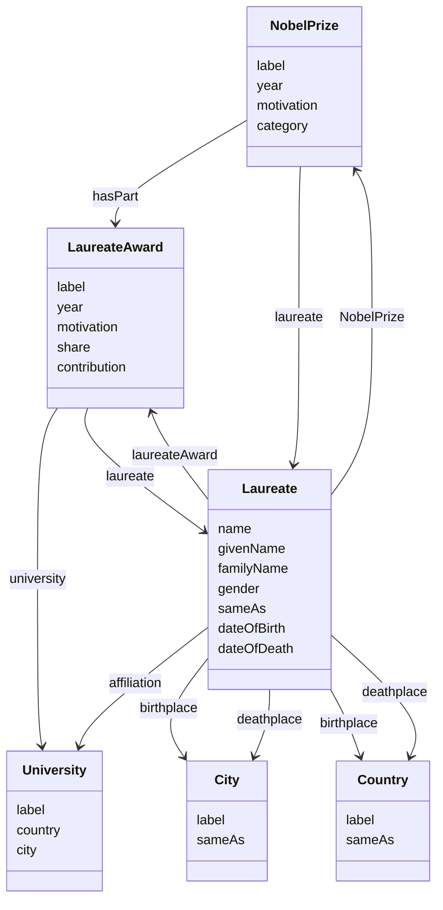
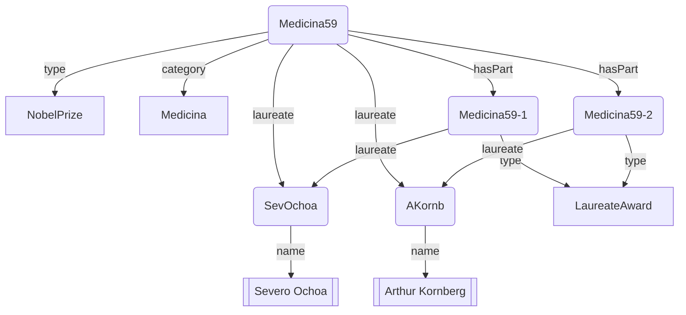
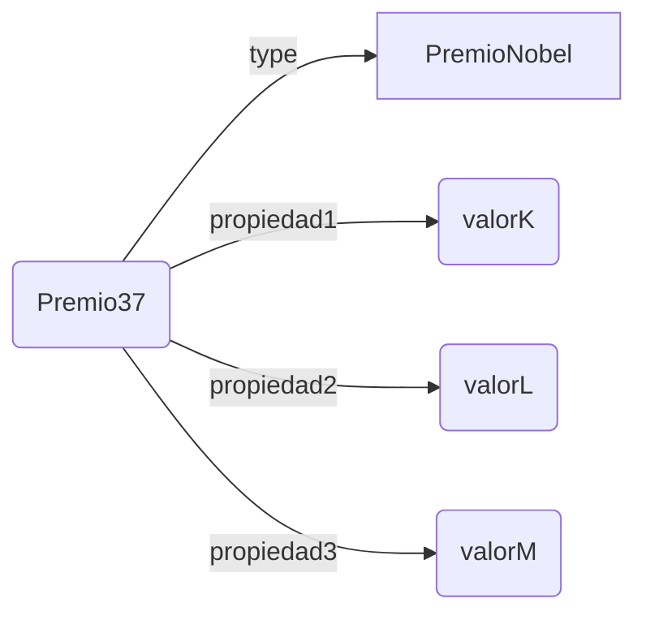

# El vocabulario NobelPrize

Siempre se pueden ejecutar consultas generalistas sobre un repositorio desconocido para ir descubriendo su estructura. Para facilitar este acercamiento, los repositorios públicos presentan documentación sobre el nombre de sus clases, de sus propiedades y de cómo se usan para interrelacionar datos en el grafo que albergan.

## Clases y propiedades en Nobelprizes

> La especificación del vocabulario se encuentra en [https://data.nobelprize.org/specification/](https://data.nobelprize.org/specification/)

El siguiente diagrama (del estilo de un diagrama de clases) no debe confundirse con un grafo RDF. Restringe, p.ej, a cualquier elemento X de la clase NobelPrize *(X type NobelPrize)* a tener propiedades como 'category' *(X category Y)* y a relacionarse mediante la propiedad 'laureate' *(X laureate Z)* con algún elemento Z de la clase Laureate *(Z type Laureate)* , que puede tener propiedades como 'name' *(Z name W)*.



+ Clase `NobelPrize` _(Premio Nobel)_: cada año hay un único premio Nobel concedido por cada categoría, que puede repartirse a lo sumo entre tres personas o instituciones.
z
+ Clase `LaureateAward` _(Reconocimiento)_: como se puede compartir, hay un reconocimiento individualizado que tiene, entre otros atributos, la proporción reconocida a cada contribución

+ Clase `Laureate` _(Premiado)_: la persona o institución que recibe el premio.

### Ejemplo: el Nobel de Medicina 1959
De manera informal, se representa algunos de los enunciados RDF que describen la concesión del Nobel de Medicina de 1959.



Severo Ochoa tiene por identificador `http://data.nobelprize.org/resource/laureate/367` y una presentación html de sus datos se ofrece en la dirección (con https) https://data.nobelprize.org/resource/laureate/367. Esta página facilita los enunciados RDF sobre Severo Ochoa en varios formatos. Algunos de estos enunciados, en formato Turtle, son:

```turtle
<http://data.nobelprize.org/resource/laureate/367> 
    a <http://data.nobelprize.org/terms/Laureate>; 
    foaf:name "Severo Ochoa";
    <http://data.nobelprize.org/terms/laureateAward> <http://data.nobelprize.org/resource/laureateaward/Physiology_or_Medicine/1959/367> ;
    <http://data.nobelprize.org/terms/nobelPrize> <http://data.nobelprize.org/resource/nobelprize/Physiology_or_Medicine/1959>;
    <http://dbpedia.org/ontology/birthPlace> <http://data.nobelprize.org/resource/country/Spain> ;
    owl:sameAs <http://www.wikidata.org/entity/Q233957> .

```

Los datos sobre Arthur Kornberg se presentan en la página https://data.nobelprize.org/resource/laureate/368, desde donde se pueden descargar sus enunciados RDF.


## Premios, reconocimientos y premiados
Se proponen consultas cuyo patrón consta de dos enunciados. El primero sirve para restringir el colectivo de elementos de interés (Premios, Reconocimientos o Premiados). Y el segundo enunciado simplemente recaba toda la información sobre cada elemento.

### Todo, de cada Premio Nobel
:::{hint} Consulta: de cada Premio Nobel X, todos sus enunciados \<X\> \<prop\> \<obj\>
:label: query-cada-premionobel-todo
:class: dropdown
:open: 
```SPARQL
PREFIX rdf: <http://www.w3.org/1999/02/22-rdf-syntax-ns#>
PREFIX nobel: <http://data.nobelprize.org/terms/>

SELECT ?premioNobel ?propiedad ?objeto
WHERE {
  ?premioNobel rdf:type nobel:NobelPrize .
  ?premioNobel ?propiedad ?objeto .
}
ORDER BY ?premioNobel
LIMIT 100000
```
:::

:::::{admonition} Estructura de la consulta
:class: dropdown
:open:
Este patrón de consulta consta de dos enunciados. Cada concordancia debe cumplir ambos: un determinado identificador del tipo `NobelPrize` que además aparece como sujeto de enunciados. 

El siguiente diagrama informal muestra el término Premio37 que cumple ser Premio Nobel (luego es candidato, a medias, a cumplir el patrón) y además es sujeto (entre otros) de un enunciado como *\<Premio37\> \<propiedad2\> \<valorL\>*. Es decir, para las variables del patrón (?premioNobel, ?propiedad, ?objeto) los valores (Premio37, propiedad2, valorL) hace concordar el patrón con el grafo.


La tabla de resultados que se produce internamente es la siguiente:
:::{math}
:enumerated: false
\begin{array}{ccc}
?premioNobel & ?propiedad & ?objeto \\ \hline
Premio35 & type & PremioNobel \\
Premio35 & propiedad & valor \\
Premio35 & otra\_propiedad & su\_valor
\end{array}
:::
:::::

**Resultados**. Cuando se copia, pega y ejecuta la consulta en https://data.nobelprize.org/sparql se obtienen algo más de veintiocho mil resultados.


### Todo, de cada Premiado

:::{hint} Consulta: de cada Premiado X, todos sus enunciados \<X\> \<prop\> \<obj\>
:label: query-cada-premiado-todo
:class: dropdown
:open: 

```SPARQL
PREFIX rdf: <http://www.w3.org/1999/02/22-rdf-syntax-ns#>
PREFIX nobel: <http://data.nobelprize.org/terms/>

SELECT ?premiado ?propiedad ?objeto
WHERE {
  ?premiado rdf:type nobel:Laureate .
  ?premiado ?propiedad ?objeto .
}
ORDER BY ?premiado
LIMIT 100000
```
:::
**Resultados**. Cuando se copia, pega y ejecuta la consulta en https://data.nobelprize.org/sparql se obtienen casi setenta y dos mil resultados.

### Todo, de cada Reconocimiento
:::{hint} Consulta: de cada Reconocimiento X, todos sus enunciados \<X\> \<prop\> \<obj\>
:label: query-cada-reconocimiento-todo
:class: dropdown
:open: 

```SPARQL
PREFIX rdf: <http://www.w3.org/1999/02/22-rdf-syntax-ns#>
PREFIX nobel: <http://data.nobelprize.org/terms/>

SELECT ?reconocimiento ?propiedad ?objeto
WHERE {
  ?reconocimiento rdf:type nobel:LaureateAward .
  ?reconocimiento ?propiedad ?objeto .
}
ORDER BY ?reconocimiento
LIMIT 100000
```
:::
**Resultados**. Cuando se copia, pega y ejecuta la consulta en https://data.nobelprize.org/sparql se obtienen casi cincuenta y seis mil resultados.

