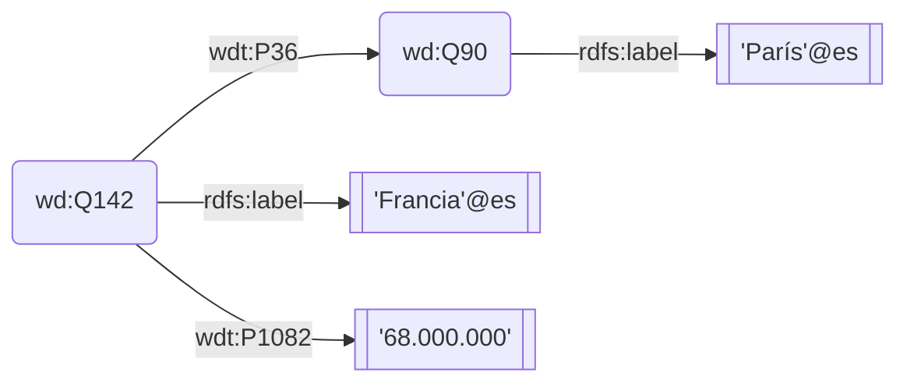
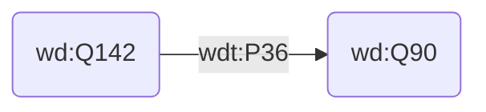
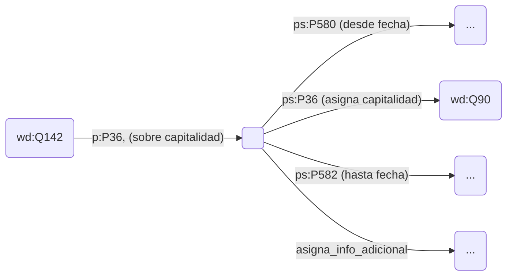

# Enunciados en Wikidata

Los identificadores en Wikidata no son legibles (en algún idioma). Comienzan por un prefijo propio (mayoritariamente wd: o wdt:) y finalizan ese identificador URI por Qxxx o por Pxxx. Los siguientes enunciados, tal y como se codifican en Wikidata, se representan en el grafo posterior.

+ _"\<Francia (Q142)\> \<tiene por capital (P36)\> \<París (Q90)\>_
+  _\<Francia (Q142)\> \<tiene una población (P1028) de\> 68.000.000"_. 



Adicionalmente, se han añadido enunciados que asignan una etiqueta textual (rdfs:label), en español en este caso. Formalmante, las tripletas almacenadas son:

```SPARQL
PREFIX wd: <http://www.wikidata.org/entity/>
PREFIX wdt: <http://www.wikidata.org/prop/direct/>
PREFIX rdfs: <http://www.w3.org/2000/01/rdf-schema#>

wd:Q142 wdt:P36 wd:Q90 .
wd:Q142 wdt:P1082 "68.000.000" .
wd:Q142 rdfs:label "Francia"@es .
wd:Q90 rdfs:label "París"@es .
```

## Identificadores en Wikidata
Los identificadores del ejemplo anterior son direcciones URL que comienzan con espacios de nombre propios de Wikidata (wd, wdt) y alguno ajeno (rdfs). Y, en el caso de los datos propios de Wikidata, finalizan por un código Q (Q142 ó Q90) o un código P (P36, P1082).

### Q-ítems
Cada concepto que se describe en Wikidata, con enunciados sobre ese sujeto, tiene asignado un código Q numerado. Estos conceptos descritos en Wikidata se conocen como ítems. Todos ellos se agrupan en un mismo espacio de nombres (wd).
+ `<http://www.wikidata.org/entity/Q142>` , abreviado como `wd:Q142`, es el identificador fijo y público de _Francia_ en Wikidata

### P-propiedades
Cada propiedad que se utiliza en Wikidata tienen asignado un código P numerado. El mismo código P se puede ver precedido de distintos espacios de nombre, para diferenciar sus usos sintácticos. De momento nos restringimos al uso de la propiedad en enunciados directos (wdt):
+ `<X> <http://www.wikidata.org/prop/direct/P36> <Y>`, abreviado como `wdt:P36`, es el identificador de la propiedad _tiene\_capital_ cuando se usa en enunciados directos, para asignar a X su capital Y.

Conviene resaltar que _tiene\_capital_, aparte de su uso funcional como propiedad, es en sí mismo un concepto del que se pueden declarar enunciados que lo describen, donde aparece como sujeto. En este caso, P36 como sujeto aparece con el mismo espacio de nombres que el resto de los ítems de Wikidata (wd).
+ `<http://www.wikidata.org/entity/P36>`, abreviado como `wd:P36` es el identificador de _tiene\_capital_ cuando aparece como sujeto en enunciados sobre este ítem.

## Enunciados en Wikidata

### Enunciados directos
La capitalidad de Francia se puede declarar en un enunciado directo, como ya se ha visto, o expresándola como una estructura RDF más compleja, mediante reificación o como relación n-aria. Como enunciado directo tiene la siguiente expresión.

:::::{topic} Enunciados RDF en Wikidata: Francia tiene por capital París
```SPARQL
PREFIX wd: <http://www.wikidata.org/entity/>
PREFIX wdt: <http://www.wikidata.org/prop/direct/>

wd:Q142 wdt:P36 wd:Q90 .
```
:::::



La siguiente consulta SPARQL pregunta por el valor de la variable ?capital para _Francia_. Y de este valor solicita todas sus etiquetas, de las que tan sólo se queda con la etiqueta en español. El único resultado de la consulta es: *(wd:Q90, "París"\@es)*

:::::{hint} Consulta: capital de Francia, con su etiqueta en español
:label: query-capital-francia-wdt
:class: dropdown
:open: 

```SPARQL
PREFIX wd: <http://www.wikidata.org/entity/>
PREFIX wdt: <http://www.wikidata.org/prop/direct/>
PREFIX rdfs: <http://www.w3.org/2000/01/rdf-schema#>

SELECT ?capital ?capitalEtiq
WHERE {
  wd:Q142 wdt:P36 ?capital .
  ?capital rdfs:label ?capitalEtiq .
  FILTER(LANG(?capitalEtiq)="es")
}
```
:::::

**Ejecución de la consulta**
+ Se puede copiar, pegar y ejecutar esta consulta en [https://query.wikidata.org/](https://query.wikidata.org/). 
+ Tras una ejecución, se obtuvo allí el enlace [https://w.wiki/6egu](https://w.wiki/6egu), que  transmite esta consulta a esa dirección y nos sitúa en ese interfaz para ejecutarla.
:::::

### Enunciados indirectos
En principio, Wikidata no almacena inicialmente un enunciado como *wd:Q142 wdt:P36 wd:Q90* ("Francia tiene por capital París") de forma directa. Utiliza una estructura de almacenamiento algo más compleja pero versátil:

+ De Francia, 'acerca de su capitalidad' (p:P36), se afirma 'una sentencia' (nodo en blanco)
  - y en esta 'sentencia' compuesta se asigna capitalidad (ps:P36) con valor París (wd:90)
  - adicionalmente en esta 'sentencia' se asigna *desde fecha* (con valor ...)
  - adicionalmente en esta 'sentencia' se asigna *hasta fecha* (con valor ...)
  - adicionalmente es esta 'sentencia' se puede añadir *otra_propiedad* (con valor ...)
  - ...



En resumen, sobre Francia y acerca de su capitalidad (p:P36) se enuncia un 'statement' complejo (un nodo en blanco, con identificador interno asignado por el sistema). Y en este nodo en blanco se van asignando valores a propiedades.
+ Dentro del 'statement' la asignación del valor de capitalidad es `ps:P36` (con prefijo ps), mientras que externamente la propiedad `p:P36` conducía de Francia al statement sobre su capitalidad.
+ De igual forma, otras propiedades Pxxx se usan con prefijo ps:Pxxx cuando asignan valores dentro de un statement (y se usan como p:Pxxx) cuando relacionan un término con un statement acerca de esa propiedad.

Ocurre que _Francia_ ha tenido históricamente varias capitales, alguna de ellas en el exilio durante la Segunda Guerra Mundial. Todas ellas se han registrado en Wikidata en su formato usual, como enunciado indirecto.  La siguiente consulta recorre los enunciados indirectos (los statements) sobre capitalidad de Francia y recupera más de uno. Por legilibidad de la consulta, no se pregunta por las fechas de inicio y fin.

:::::{hint} Consulta: enunciados indirectos que asignan capitalidad a Francia
:label: query-capital-francia-enunciados-indirectos
:class: dropdown
:open: 
```SPARQL
SELECT ?stmt ?capital ?capitalEtiq
WHERE {
  wd:Q142 p:P36 ?stmt .
  ?stmt ps:P36 ?capital .
  ?capital rdfs:label ?capitalEtiq .
  FILTER(LANG(?capitalEtiq)="es")
}
```
[Ejecución en Wikidata](https://w.wiki/DaC3)
:::::

Wikidata exporta como enunciados directos algunos de estos enunciados indirectos. La exportación se decide atendiendo a varios requisitos, entre los que se incluye la mayor verosimilitud o, en casos como el de capitalidades, manteniendo como enunciado directo tan sólo la capital actual. De esta forma, [se pudo ejecutar una consulta SPARQL sobre capitalidad](#query-capital-francia-wdt) de Francia buscando enunciados directos (X wdt:P36 Y) y devolvía un solo resultado: su capital actual.

:::{important} Obviar los enunciados indirectos en una primera aproximación
Inicialmente se puede considerar que Wikidata expone toda su información en forma de enunciados directos `<wd:Qxxx> <wdt:Pzzz> <wd:Qyyyy>` y reservar para un uso más especializado la consulta a enunciados indirectos como `<wd:Qxxx> <p:Pzzz> <_:stmtK>` y `<_:stmtK> <ps:Pzzzz> <wd:Qyyy>` (quizá con otras tripletas informativas añadidas desde \_:stmtK).
:::

## Etiquetas en Wikidata
Cada Q-ítem en Wikidata tiene asignadas varias etiquetas textuales mediante tripletas `<Qxxx> <prop> <etiqueta>`. En concreto, por cada idioma, un ítem tiene asignadas: 
+ Una etiqueta textual principal (mediante la propiedad `rdfs:label`) 
+ Una descripción textual más extensa (mediante la propiedad `schema:description`) 
+ Y opcionalmente varias etiquetas alternativas (mediante la propiedad `skos:altLabel`) 

Todo ello posiblemente repetido para más de un idioma. La siguiente consulta demanda todas las etiquetas principales (rdfs:label) de _Francia_ y adicionalmente extrae de ellas el idioma: por ejemplo, de "Francia"\@es extrae 'es' (español).

:::::{hint} Consulta: Etiquetas principales asociadas a Francia (Q142), con su idioma
:label: query-francia-etiquetas
:class: dropdown
:open: 
```SPARQL
SELECT ?etiqueta ?idioma
WHERE {
  wd:Q142 rdfs:label ?etiqueta .
  BIND(LANG(?etiqueta) AS ?idioma)
}
```
[Ejecución en Wikidata](https://w.wiki/DaCX)
:::::

### Filtrado por idiomas
En una consulta previa ya se ha mostrado como filtrar resultados por un idioma concreto utilizando FILTER. Wikidata **facilita la consulta a un servicio adicional (específicamente indexado) para facilitar este filtrado por idiomas**. Se utiliza en la siguiente consulta.

:::::{hint} Consulta: filtrado por idiomas más eficiente usanod wikibase:language
:label: query-servicio-wikibase-language
:class: dropdown
:open: 

```SPARQL
SELECT ?capital ?capitalLabel ?capitalDescription ?capitalAltLabel
WHERE {
  wd:Q142 wdt:P36 ?capital .                                             #1
  SERVICE wikibase:label { bd:serviceParam wikibase:language "es,en". }  #2
}
```
[Ejecución en Wikidata](https://w.wiki/6ehb)
:::::

La llamada a este servicio (en #2) devuelve, **para cada valor de cada variable** en WHERE, sus etiquetas en un idioma. El filtrado indica que se busquen etiquetas en español y, si no se encontraran, que se faciliten en inglés.

Este servicio devuelve la etiqueta principal de una variable (?variable) en `?variableLabel`, la descripción en `?variableDescription` y el conjunto agregado de etiquetas alternativas en `?variableAltLabel`. Es decir, para una variable discrecionalmente denominada `?capital` hay que buscar obligatoriamente estas etiquetas textuales en `?capitalLabel`, `?capitalDescription`, `?capitalAltLabel`, que deben escribirse literalmente con esos sufijos.